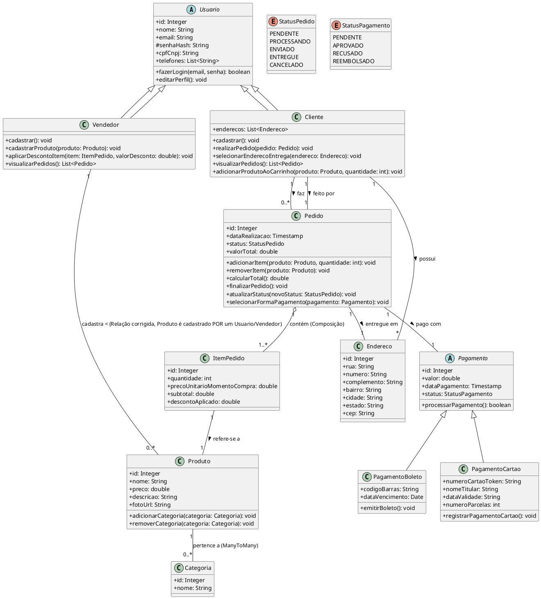

# CliqCompra: Sistema Integrado de Mediação de Compras e Vendas

## Sumário
- [Sobre o Projeto](#sobre-o-projeto)
- [Inspiração e Objetivo Final](#inspiração-e-objetivo-final)
- [Atores do Sistema](#atores-do-sistema)
- [Funcionalidades Implementadas e Previstas](#funcionalidades-implementadas-e-previstas)
- [Principais Casos de Uso (Conforme Documentação Original)](#principais-casos-de-uso-conforme-documentação-original)
- [Requisitos Não Funcionais (Visão Geral)](#requisitos-não-funcionais-visão-geral)
- [Modelo de Dados (UML)](#modelo-de-dados-uml)
- [Autores](#autores)

## Sobre o Projeto
CliqCompra é uma plataforma de e-commerce em desenvolvimento, construída com Java e Spring Boot. O projeto, originalmente intitulado "Sistema Integrado de Mediação de Compras e Vendas para Usuários em Ambiente Virtual"[cite: 1], visa criar um ambiente online para a compra e venda de produtos, servindo como um intermediário entre usuários. A ideia é facilitar as transações comerciais de forma simples e eficiente, simulando uma estrutura básica de e-commerce[cite: 4].

Este é um projeto acadêmico (2024)[cite: 1, 2], com foco na simplicidade e na aplicação prática dos conceitos estudados[cite: 6].

## Inspiração e Objetivo Final
O projeto é **inspirado em plataformas de sucesso de intermediação de vendas, como a OLX**. O objetivo final é evoluir o CliqCompra para um marketplace completo e robusto, onde usuários (tanto consumidores quanto vendedores – Pessoas Físicas ou Jurídicas) possam anunciar, descobrir e negociar uma ampla variedade de produtos de forma intuitiva e segura. Queremos facilitar a conexão direta entre quem quer vender e quem quer comprar, promovendo um ecossistema de comércio dinâmico e acessível. O objetivo original do sistema é permitir a interação entre compradores e vendedores em um ambiente virtual, facilitando a divulgação de produtos, realização de pedidos e gerenciamento de pagamentos[cite: 3].

## Atores do Sistema
Conforme a documentação original e o desenvolvimento atual:
* **Usuário Visitante**: Aquele que acessa o sistema sem estar autenticado[cite: 51].
* **Usuário Cadastrado (Cliente ou Vendedor)**: Pessoa que possui conta no sistema[cite: 52]. O sistema atualmente tem um fluxo principal de cadastro focado no perfil de `Cliente`, mas a estrutura de `Usuario.java`, `Cliente.java`, e `Vendedor.java` suporta essa distinção.
* **Sistema de Pagamento (Previsto)**: Serviço externo ou simulado que processaria os pagamentos[cite: 54, 63, 64, 65]. Modelos como `Pagamento.java`, `PagamentoBoleto.java`, e `PagamentoCartao.java` indicam essa intenção.

## Funcionalidades Implementadas e Previstas

**Funcionalidades Atuais (Conforme `guiperlasca/cliqcompra/CliqCompra-2b55bac3ccc2e61c268c5d2fdf052eb52f4ff5f7/README.md` e código-fonte):**
* **Gerenciamento de Usuários:**
    * Cadastro de novos usuários (foco no perfil de `Cliente`), conforme `WebController.java` (método `processRegistration`).
    * Login e Logout de usuários com persistência de sessão, via `WebController.java` (métodos `processLogin`, `logout`).
    * Hashing de senhas para segurança utilizando BCrypt, implementado em `PasswordService.java`.
* **Gerenciamento de Produtos:**
    * Listagem de todos os produtos disponíveis para compra, via `WebController.java` (método `produtos`) e `ProdutoController.java` (`listarTodosProdutos`).
    * Permite que usuários logados adicionem novos produtos ao sistema, associando o produto ao usuário que o cadastrou. Implementado em `WebController.java` (método `processAddProduct`). O `Produto.java` possui associação com `Usuario.java`.
    * Upload de fotos para os produtos, que são armazenadas localmente e exibidas nas listagens. `WebController.java` (método `processAddProduct`) gerencia `fotoFile`.
    * Visualização dos produtos anunciados pelo próprio usuário na seção "Meus Produtos", via `WebController.java` (método `showMyProducts`).
* **Carrinho de Compras:**
    * Adição de produtos ao carrinho de compras, via `WebController.java` (método `addToCart`).
    * Visualização detalhada do carrinho, via `WebController.java` (método `viewCart`).
    * Atualização da quantidade de itens no carrinho, via `WebController.java` (método `updateCartItem`).
    * Remoção de itens do carrinho, via `WebController.java` (método `removeCartItem`).
    * O carrinho de compras é mantido por sessão de usuário, configurado em `ShoppingCartService.java` com `@Scope(value = WebApplicationContext.SCOPE_SESSION)`.
* **Processo de Compra (Checkout):**
    * Seleção de endereço de entrega a partir dos endereços previamente cadastrados pelo `Cliente`. `WebController.java` (método `showAddressSelectionPage`).
    * Gerenciamento de múltiplos endereços pelo `Cliente` (Adicionar e Listar). `WebController.java` (métodos `showAddAddressForm`, `processAddAddress`, `showMyAddressesPage`).
    * Página de confirmação dos detalhes do pedido antes da finalização. `WebController.java` (método `showConfirmOrderDetailsPage`).
    * Finalização do pedido, com registro no sistema e limpeza do carrinho. `WebController.java` (método `placeOrder`). O pedido é salvo com status inicial PENDENTE.
* **Histórico de Compras:**
    * Clientes podem visualizar o histórico de seus pedidos realizados. `WebController.java` (método `showMyOrders`).
    * Página de confirmação/detalhamento do pedido acessível após a compra ou pelo histórico. `WebController.java` (método `showOrderConfirmationPage`).
* **API REST:**
    * Endpoints básicos foram criados para `Pedidos`, `Produtos` e `Usuários`, permitindo interações via HTTP. Ver `PedidoController.java`, `ProdutoController.java`, `UsuarioController.java`.

**Funcionalidades Previstas (Baseado na Documentação Original [cite: 1] e Modelos):**
* **Categorização de Produtos**: O sistema deve permitir que um produto pertença a uma ou mais categorias[cite: 16]. O modelo `Produto.java` inclui `List<Categoria> categorias`, e `Categoria.java` está definido.
* **Descontos**: Permitir aplicar desconto individual por produto no pedido[cite: 20]. O modelo `ItemPedido.java` possui `descontoAplicado`.
* **Múltiplas Formas de Pagamento**: Permitir pagamento por boleto ou cartão de crédito[cite: 26]. Os modelos `PagamentoBoleto.java` e `PagamentoCartao.java` existem.
    * Registrar data de vencimento e pagamento para boleto[cite: 28]. O modelo `PagamentoBoleto.java` inclui `dataVencimento`.
    * Permitir parcelamento em cartão de crédito[cite: 29]. O modelo `PagamentoCartao.java` inclui `numeroParcelas`.
* **Status de Pagamento**: Registrar o estado do pagamento (pendente, quitado ou cancelado)[cite: 31]. O modelo `Pagamento.java` possui `StatusPagamento`.

## Principais Casos de Uso (Conforme Documentação Original `CLIQCOMPRA DOC.docx`)
* **UC01 - Cadastrar Usuário**: Permite que o visitante crie uma conta no sistema[cite: 55].
* **UC02 - Fazer Login**: Permite que o usuário cadastrado acesse o sistema[cite: 57].
* **UC03 - Editar Perfil**: Permite ao usuário alterar seus dados pessoais[cite: 1]. (Funcionalidade básica de cadastro existe, edição de perfil pode ser uma melhoria futura).
* **UC04 - Cadastrar Produto**: Usuários (atualmente qualquer logado, originalmente Vendedores [cite: 15]) podem adicionar produtos[cite: 59].
* **UC05 - Pesquisar Produtos**: Usuários podem buscar produtos[cite: 60]. (Listagem implementada, busca/filtros avançados podem ser melhorias).
* **UC06 - Adicionar Produto ao Carrinho**: Usuário escolhe produtos e define a quantidade[cite: 61].
* **UC07 - Realizar Pedido**: Finaliza o pedido, selecionando produtos, endereço e aplicando descontos[cite: 62].
    * *Inclui*: UC08 - Selecionar Forma de Pagamento[cite: 63]. (Seleção explícita de forma de pagamento no UI é uma melhoria futura).
* **UC09 - Emitir Boleto**: Emite boleto com data de vencimento e registra pagamento[cite: 64]. (Previsto pelo modelo).
* **UC10 - Registrar Pagamento com Cartão**: Define parcelas e confirma transação[cite: 65]. (Previsto pelo modelo).
* **UC11 - Acompanhar Pedido**: Usuário pode consultar os pedidos realizados e status[cite: 66].

## Requisitos Não Funcionais (Visão Geral da Documentação Original `CLIQCOMPRA DOC.docx`)
* **Usabilidade**: Interface simples e fácil de usar[cite: 38].
* **Compatibilidade**: Funcionar em navegadores modernos (Chrome, Firefox, Edge)[cite: 39].
* **Responsividade**: Funcionamento básico em celulares e computadores[cite: 41].
* **Segurança**:
    * Senhas armazenadas de forma segura (criptografadas)[cite: 43]. (Implementado com BCrypt).
    * Validação de campos obrigatórios (CPF/CNPJ, e-mail)[cite: 44].
    * Armazenamento seguro de informações importantes (pedidos, pagamentos)[cite: 50].
* **Desempenho**: Carregamento rápido de páginas principais (até 3 segundos)[cite: 1]. (Prioridade Média [cite: 1]).
* **Manutenibilidade**: Código organizado para facilitar manutenção[cite: 48]. (Estrutura Spring Boot MVC e services).

## Modelo de Dados (UML)
A estrutura do modelo de dados do sistema está representada no diagrama UML abaixo (conforme `guiperlasca/cliqcompra/CliqCompra-2b55bac3ccc2e61c268c5d2fdf052eb52f4ff5f7/README.md`), que foi concebido para suportar as funcionalidades atuais e futuras da plataforma:

#A#utores

Alexandre Foppa 
Arthur Portaluppi 
Guilherme Perlasca 
João Caumo 
Kauã Xavier
