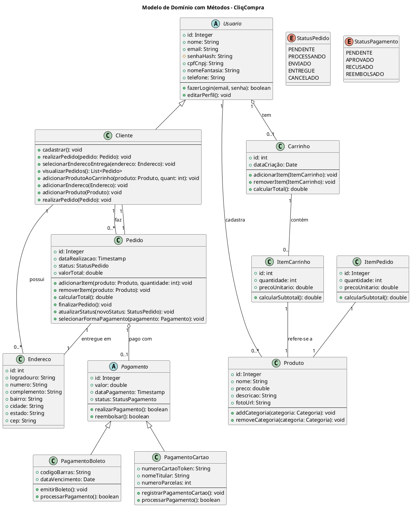

# CliqCompra: Plataforma de E-commerce

## Sumário
- [Sobre o Projeto](#sobre-o-projeto)
- [Modelo de Dados (UML)](#modelo-de-dados-uml)
- [Tecnologias Utilizadas](#tecnologias-utilizadas)
- [Autores](#autores)

---
## Sobre o Projeto
CliqCompra é uma plataforma de e-commerce em desenvolvimento, construída com Java e Spring Boot. Originalmente intitulado "Sistema Integrado de Mediação de Compras e Vendas para Usuários em Ambiente Virtual", o sistema visa criar um ambiente online para a compra e venda de produtos, atuando como intermediário entre usuários.

O objetivo é simular uma estrutura básica de e-commerce, permitindo a interação entre compradores e vendedores, a divulgação de produtos, a realização de pedidos e o gerenciamento de pagamentos.

Este é um projeto acadêmico desenvolvido com foco na aplicação prática de conceitos de desenvolvimento de software e na experimentação de funcionalidades de um sistema web real de forma acessível.

---
## Modelo de Dados (UML)
A estrutura do modelo de dados do sistema está representada no diagrama UML abaixo, concebido para suportar as funcionalidades da plataforma:

## Tecnologias Utilizadas
O projeto utiliza as seguintes tecnologias principais:

Java (versão 21)
Spring Boot (versão 3.5.0)
Spring Web (MVC)
Spring Data JPA
Spring Boot DevTools
Thymeleaf com Layout Dialect (para templates web)
Spring Security Crypto (para hashing de senhas com BCrypt)
H2 Database (banco de dados em memória para desenvolvimento)
Spring Boot Starter Validation
Apache Maven (ferramenta de build)

---
## Autores
Este projeto foi desenvolvido por:

- Alexandre Foppa
- Arthur Portaluppi
- Guilherme Perlasca
- João Caumo
- Kauã Xavier
